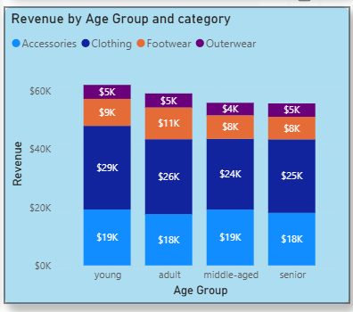

# 📊 Customer Purchase Behavior Analysis

## 📝 Project Overview
This capstone project presents an end-to-end data analysis workflow using **Python, SQL, and Power BI** to understand customer purchasing behavior.

The project focuses on how customers make buying decisions across product categories such as **footwear, clothing, accessories, and outerwear**. It highlights customer preferences, spending patterns, and subscription trends to derive meaningful business insights.

---

## 🎯 Objectives
- Analyze customer behavior across different product categories  
- Understand **subscription vs non-subscription trends**  
- Evaluate **total purchases and spending patterns**  
- Perform **age group-based analysis**  
- Visualize insights using interactive dashboards  

---

## 🛠️ Tech Stack
- **Python** – Data cleaning, preprocessing, and analysis  
- **SQL** – Data extraction, transformation, and querying  
- **Power BI** – Dashboard creation and visualization  

---

## 📂 Workflow

### 1️⃣ Data Cleaning & Preparation (Python)
- Removed inconsistencies and handled missing values  
- Prepared structured data for analysis  

### 2️⃣ Data Processing (SQL)
- Wrote queries for filtering, joins, and aggregations  
- Extracted meaningful datasets for reporting  

### 3️⃣ Data Visualization (Power BI)
- Built interactive dashboards  
- Represented insights using various charts  

---

## 📊 Key Insights
- Distribution of **subscribed vs non-subscribed customers**  
- Total **items purchased** and **amount invested**  
- Category-wise purchasing trends  
- **Age group analysis** of spending behavior  
- Customer decision-making patterns  

---

## 📈 Visualizations Used
- Treemap  
- Stacked Column Chart  
- Line Chart  
- Pie Chart  
- Ribbon Chart
  
These visuals provide a clear and interactive way to explore customer behavior.

---

## 🚀 Results
This project demonstrates how integrating multiple tools can help perform **real-world data analysis** and generate actionable insights. It enables better understanding of customer preferences, helping businesses make data-driven decisions.

---

## 🔮 Future Enhancements
- Implement predictive analytics using Machine Learning  
- Include additional demographic features  
- Improve dashboard interactivity and user experience  

---

## 📷 Dashboard Preview

  

---

## 📁 Repository Structure
├── data/ # Dataset files
├── python/ # Data cleaning & analysis scripts
├── sql/ # SQL queries
├── powerbi/ # Power BI dashboard file (.pbix)
└── README.md

---

## 🤝 Contribution
Contributions are welcome! Feel free to fork this repository and improve the analysis.

---

## 📬 Contact
For any queries or collaboration, feel free to reach out.
